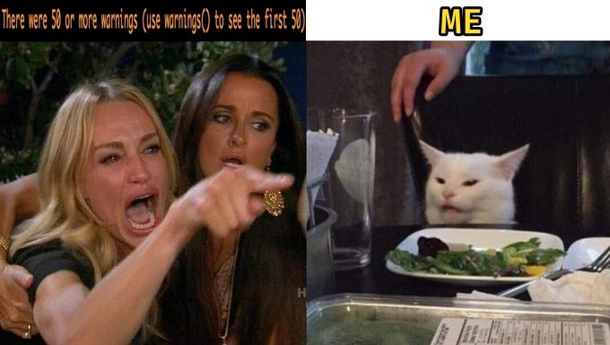

```{r setup}
knitr::opts_chunk$set(echo = TRUE, warning = FALSE, message = FALSE, tidy = TRUE)

```

# Intro


**What is R markdown?**

- A way to turn your statistical analysis into a journal quality report.
- An alternative to r-scripts.
- A tool to be used in the movement towards transparent and reproducible science.

**Why do I use R markdown?**

- Annotating code is much easier.
- To create documents to share analyses with supervisors / collaborator.
- To create supplementary material documents.
- To report the code used to create figures and run analysis.
- To share raw data.

**What else could I use it for?**

- You can create presentations, websites and even write your thesis in Rmarkdown!
- Combine different coding languages within the same document.


# Knitting 

Once we have our analysis up and running, we can produce a html, word doc or pdf from this .Rmd file (Rmarkdown file), using the Knit button next to Find/replace.

A good first step is to specify how you want to refine the document by editing the **YAML header**.

Aesthetics to consider:

- Code folding: If echo is set to true (default) then your code will display alongside the output. Code folding hides the code unless it is requested. Very handy for long code chunks. Specify 'hide' to start with hidden code and 'show' to start with visible code.

- toc: table of contents. You can specify the table of contents to 'float' as you scroll through the document. When writing the document use # to denote heading to be used in the toc. 'Depth' can also be used to specify how many levels of headings you would like to be included in the toc e.g. #, ##, ### etc.

- Theme: this controls how your document will look. Check this [blogpost](http://www.datadreaming.org/post/r-markdown-theme-gallery/) out for a rundown on available themes. I've used the sandstone theme for this document.

- Code download: this allows people to download your markdown file from the html document. Great for data and analysis transparency.

- always_allow_html: yes. This makes it possible to render PDFs or word docs when there is html-exclusive material in the document. I wouldn't recommend. 


# Using markdown:

R markdown can be broken down into two categories: writing and code chunks.


## Writing

The first thing to note is you don't need hashtags to write outside of 'code chunks'.

Writing outside of code chunks works similarly to word processing programs. 

### Syntax tips to create effects:

- **Bold** is coded by enclosing the word with **

- _Italics_ are coded by enclosing the word with _

- Superscript^2^ is coded by enclosing with ^

- Subscript~2~ is coded by enclosing with ~

- Equations:  $\Delta \overline{W} = V_{A, W}$, enclose with $

- Dotpoints are coded by starting a sentence with -, * or +

- Hyperlink: <https://www.rstudio.com/wp-content/uploads/2016/03/rmarkdown-cheatsheet-2.0.pdf> enclose with <>

- [Link](https://www.rstudio.com/wp-content/uploads/2016/03/rmarkdown-cheatsheet-2.0.pdf): use [link] then follow with (website).

- Images: !, caption in square brackets, figure file name in standard brackets.

 


### Referencing

The easiest way to reference in markdown is to export your references from your citation manager as bibtex files. Save your .bib file in your working directory then cite references as follows:

In the YAML header include bibliography: "name of bibliography file". The bibliography will be automatically generated at the end of the document.

Include the reference like this [@...ref ID here]. If you wish to cite without the authors name, use [-@...ref ID here]. 

E.g. this document was created in R-studio [@RN1]. If you want to reference multiple sources simply lsit them within the square brackets e.g. [@RN577; @RN685].


## Coding and sample analysis

This is pretty much the same as normal R-studio scripts, but there are a few important differences.

Code is written within chunks, which can be included using the green insert button. Alternatively, chunks can be manually added by enclosing lines with ```. The first set of dashes should be followed by {}. Note that you can combine different coding programs within the same document.

Within the curly brackets, you can name the chunk and provide some additional information using the following:

- Echo = T/F: do you want the script to display with the output?

- Eval = T/F: do you want R to run this chunk?

- Include = T/F: do you want the chunk to run, but not be included in the html document?

- Cache = T/F: If true the chunk will be saved when first knitted and reloaded when knitting in the future - useful for computationally    expensive outputs.

- Warning = T/F: would you like warning messages in the output?

- Message = T/F: would you like messages in the output?

- Fig.width and Fig.height: how large would you like the figure? 


Now lets load in some handy packages.

Note that we are also installing `tinytex`, which is required to knit documents to PDF files. It's a simplified version of LaTex designed specifically for R users that aren't familiar with the LaTex syntax. If you already have LaTex, I recommend doing further research before installing, as compatibility issues appear possible.

```{r you can name chunks for quick access}

# Write code as normal in here - hashtags required for annotation

library(tidyverse) # a range of packages for data manipulation and plotting
library(pander) # for nice tables
library(kableExtra) # for scrollable tables
library(ggbeeswarm) # an extension to ggplot2 that allows geom_quasirandom

# Install tinytex - you only need to do this once 

# install.packages("tinytex")
# tinytex::install_tinytex()  # install TinyTeX

```

Next lets load in some data of mine:

```{r load in data}

data <- read.csv("example_data.csv") %>%
  select(Individual, Sex, Wing.size..mm.) %>%
  filter(!is.na(Wing.size..mm.)) %>%
  rename(Wing_length = Wing.size..mm.)

```

The dataset is made up of three columns - an individual ID, the sex of the individual and the wing length of the individual. Wing length was measured for 405 fruit flies.


### Tables {.tabset .tabset-pills}

Lets create a table with the `pander` package, which makes really nice tables in html documents. 

We also can create tabs using {.tabset} after the header. Here I use this to illustrate how to create bold rows, which can be useful when you want to showoff a significant result.


#### Table

```{r fly table 1}

# I want to calculate confidence intervals from the raw data so I make this easier by creating a function

SE <- function(x) sd(x)/sqrt(length(x))

# Create a summary to display in the table. Basically I use the dplyr package (part of the tidyverse) to split the data by sex with the group_by function, then tell R to find the mean wing length for each sex and associated CIs. Finally, I create a new column called n, which gives us the number of individuals within each group. 

summary_data <- data %>%
  group_by(Sex) %>%
  dplyr::summarise(Mean_wing_length = mean(Wing_length), Lower = (Mean_wing_length - SE(Wing_length)* 1.96), Upper = (Mean_wing_length + SE(Wing_length)*1.96), n = n()) %>%
  mutate(Sex = replace(as.character(Sex), Sex == "F", "Female"),
         Sex = replace(as.character(Sex), Sex == "M", "Male")) %>%
  rename(Wing_length = Mean_wing_length) 

# Now lets make the table 

pander(summary_data, split.cell = 40, split.table = Inf, col.names = c("Sex", "Mean wing length (mm)", "Lower CI", "Upper CI", "n"), round = 3)

```

`split.cell` tells pander where to include a line break in the column names.

`split.table` tells pander where to split the table into multiple tables, Inf tells R to never split the table.

`round` specifies the number of decimal places you want presented.

More info on pander tables [here](https://rapporter.github.io/pander/pandoc_table.html).


#### Bolded table

```{r fly table 2}
pander(summary_data, split.cell = 40, split.table = Inf, col.names = c("Sex", "Mean wing length (mm)", "Lower CI", "Upper CI", "n"), emphasize.strong.rows = (2), round = 3)
```

`split.cell` tells pander where to include a line break.

`split.table` tells pander where to split the table into multiple tables, Inf tells R to never split the table.

`round` specifies the number of decimal places you want presented.

`emphasize.strong.rows` tells pander to display certain rows in bold

More info on pander tables [here](https://rapporter.github.io/pander/pandoc_table.html).


### Plots

Now lets explore our data visually with the package `ggplot2`

```{r fly size plot}

data <- data %>% mutate(Sex = replace(as.character(Sex), Sex == "F", "Female"),
                Sex = replace(as.character(Sex), Sex == "M", "Male"))

# There's a bit going on below. 

# First I plot the wing length of each fly with geom_quasirandom

# Then I use the mean and CIs we calculated for the table and plot them with geom_point and geom_errorbar

# The rest of the code is plot aesthetics


 data %>%
  ggplot(aes(x = Sex, y = Wing_length, fill = Sex, colour = Sex)) +
  geom_quasirandom(data = data, width = 0.3, size = 2, alpha =  0.5) +
  geom_point(data = summary_data, aes(x = Sex, y = Wing_length), size = 3, colour = "Black") +
  geom_errorbar(data = summary_data, aes(x = Sex, ymax = Upper, ymin = Lower), colour = "black", width = 0, size = 1.2) +
  scale_colour_manual(values = c("Female" = "#fe9929", "Male" = "#41b6c4")) +
  labs(x = "Sex", y = "Wing length (mm)") +
  theme_minimal() +
  theme(legend.position = "none") +
  theme(panel.grid.major.x = element_blank())

```

Figure 2. Female flies are larger than male flies.

For plot colours I use <http://colorbrewer2.org>.


### Raw data and session info

One of the major benefits of R markdown is the ease with which you can make your data readily available. 
I use the `kableExtra` package to include the raw data we have used. This package gives us the ability to include scrollable tables, which are very useful for large datasets. **However, the scrollbox is only available in html format.**

```{r Raw data, eval=TRUE}

kable(data, format = "html") %>%
  kable_styling(bootstrap_options = c("hover", "condensed"), fixed_thead = T) %>%
  scroll_box(height = "400px")

```

For more on `kableExtra` click [here](https://cran.r-project.org/web/packages/kableExtra/vignettes/awesome_table_in_html.html).


Finally we can also include our R session info to make it easier for others to reproduce our analysis

```{r Session info}
sessionInfo() %>% pander()
```

# Github 

Github is an online data storage and web-hosting platform that is free to join. The learning curve is pretty steep but there are very helpful guides that will ease you through it. It is here where you can archive data and host your supplementary material online document. 

I recommend this guide: <https://cfss.uchicago.edu/setup/github/>

Especially the setting up Git and Github, and using Git with R studio sections.

# Further reading 

I've only scratched the surface, for more info I recommend:

1. [R Markdown: The definitive guide](https://bookdown.org/yihui/rmarkdown/)

2. The [R markdown cheat sheet](https://www.rstudio.com/wp-content/uploads/2016/03/rmarkdown-cheatsheet-2.0.pdf)

3. Word documents knit with very basic formatting, to make them look nicer you'll need to create a 'style reference document.' More info [here](https://rmarkdown.rstudio.com/articles_docx.html).

4. The package `workflowr` integrates R markdown with github - an online hosting platform where you can store data and put your html supplementary material online - to create a reproducible and intuitive workflow for your data analysis. Once you're familiar with markdown the leap to `workflowr` is small. For more details there is an [extremely helpful walk-through](https://jdblischak.github.io/workflowr/index.html).  

# References

